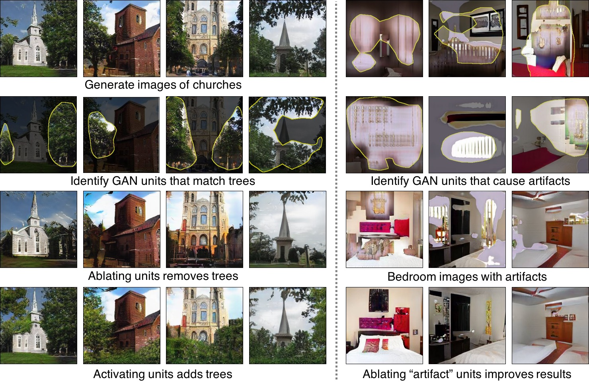
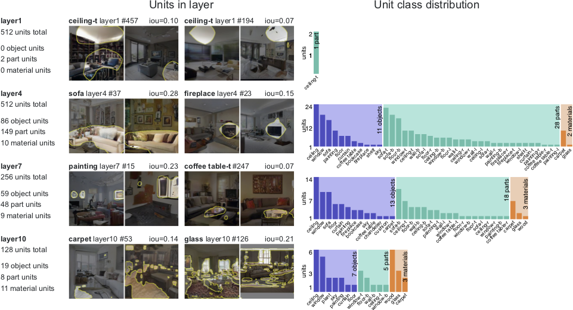
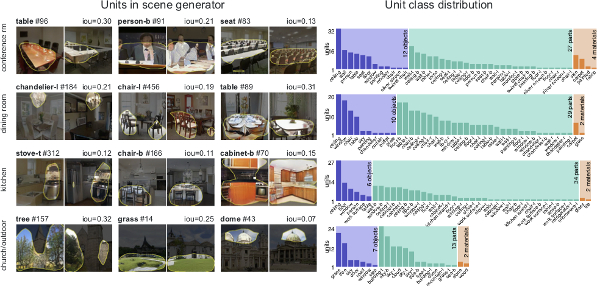
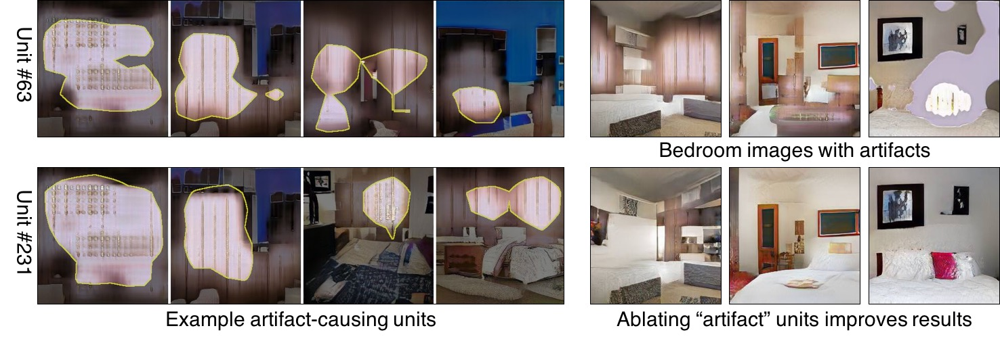
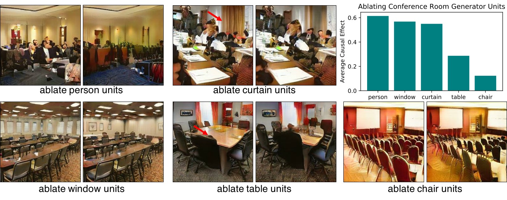
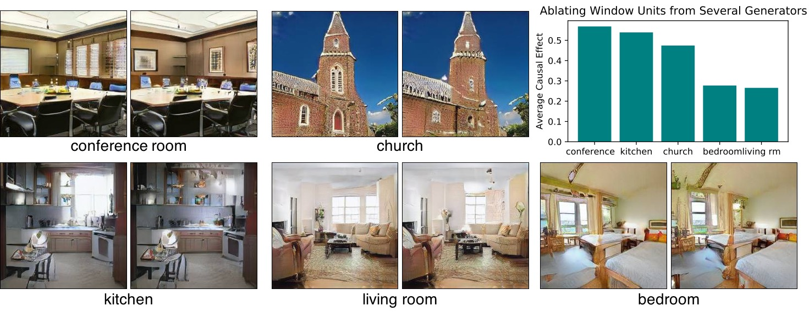
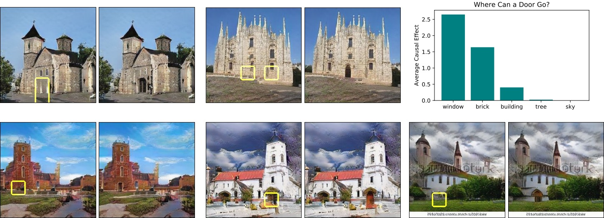

# GANDissect <a href="http://gandissect.res.ibm.com/ganpaint.html?project=churchoutdoor&layer=layer4"></a>

[**Project**](https://gandissect.csail.mit.edu/) | [**Demo**](http://gandissect.res.ibm.com/ganpaint.html?project=churchoutdoor&layer=layer4) | [**Paper**](https://arxiv.org/pdf/1811.10597.pdf) | [**Video**](http://tiny.cc/gandissect) <br>

[GAN Dissection](https://gandissect.csail.mit.edu/) is a way to inspect the internal representations of a generative adversarial network (GAN) to understand how internal units align with human-interpretable concepts. It is part of [NetDissect](https://netdissect.csail.mit.edu/).

This repo allows you to dissect a GAN model. It provides the dissection results as a static summary or as an interactive visualization. Try our interactive [GANPaint demo](http://gandissect.res.ibm.com/ganpaint.html?project=churchoutdoor&layer=layer4) to interact with GANs and draw images. 

## Overview



[Visualizing and Understanding Generative Adversarial Networks](http://gandissect.csail.mit.edu) <br>
[David Bau](http://people.csail.mit.eduÂ/davidbau/home/), [Jun-Yan Zhu](http://people.csail.mit.edu/junyanz/), [Hendrik Strobelt](http://hendrik.strobelt.com/), [Bolei Zhou](http://people.csail.mit.edu/bzhou/), [Joshua B. Tenenbaum](http://web.mit.edu/cocosci/josh.html), [William T. Freeman](https://billf.mit.edu/), [Antonio Torralba](http://web.mit.edu/torralba/www/) <br>
MIT CSAIL, MIT-IBM Watson AI Lab, CUHK, IBM Research <br>
In arXiv, 2018.


## Analysis and Applications
### Interpretable Units in GANs


### Analyzing different layers



### Diagnosing and improving GANs


### Removing objects from conference rooms


### Removing windows from different natural scenes


### Inserting new objects into images



## Release history
v 0.9 alpha  - Nov 26,  2018 <br>


## Getting Started
Let's set up the environment and dissect a `churchoutdoor` GAN. This requires some CUDA-enabled GPU and some disk space.

### Setup

To install everything needed from this repo, have `conda` available,
and run:

```
script/setup_env.sh      # Create a conda environment with dependencies
script/make_dirs.sh      # Create the dataset and dissect directories
source activate netd     # Enter the conda environment
pip install -v -e .      # Link the local netdissect package into the env
```

Optional (not needed for just running notebook examples).
```
script/download_data.sh  # Download support data and demo GANs
```

Details.  The code depends on python 3, Pytorch 1.1, and several other
packages.  For conda users, `script/environment.yml` provides the details
of the dependencies.  For pip users, `setup.py` lists everything needed.

Data.  The `download_data.sh` script downloads the segmentation dataset
used to dissect classifiers, the segmentation network used to dissect GANs,
and several example GAN models to dissect.  The downloads will go into
the directories `dataset/` and `models/`.  If you do not wish to download
the example networks, `python -m netdissect --download` will download
just the data and models needed for netdissect itself.

### Tutorial notebook introduction

For a tutorial intorduction to GAN Dissect concept, set up the notebooks:

```
cd notebooks
./setup_notebooks.sh
jupyter notebook &
```

Then run the notebook `dissect_progan.ipynb`

### Dissecting a GAN

GAN example: to dissect three layers of the LSUN living room progressive
GAN trained by Karras:

```
python -m netdissect \
   --gan \
   --model "netdissect.proggan.from_pth_file('models/karras/livingroom_lsun.pth')" \
   --outdir "dissect/livingroom" \
   --layer layer1 layer4 layer7 \
   --size 1000
```

The result is a static HTML page at `dissect/livingroom/dissect.html`, and
a JSON file of metrics at `dissect/livingroom/dissect.json`.

You can test your own model: the `--model` argument is a fully-qualified
python function or constructor for loading the GAN to test.  The
`--layer` names are fully-qualified (`state_dict`-style) names for layers.

By default, a scene-based segmentation is used but a different segmenter class
can be substituted by supplying an alternate class constructor to
`--segmenter`.  See `netdissect/segmenter.py` for the segmenter base class.

## Running a GAN editing server (alpha)


Once a GAN is dissected, you can run a web server that provides an API
that generates images with (optional) interventions.

```
python -m netdissect.server --address 0.0.0.0
```


The editing UI (right) is served at [http://localhost:5001/](http://localhost:5001/) .

Other URLs:

- [http://localhost:5001/api/ui](http://localhost:5001/api/ui) is the OpenAPI/swagger UI for directly
    testing GAN interventions.
- [http://localhost:5001/data/livingroom/dissect.html](http://localhost:5001/data/livingroom/dissect.html) static net
    dissection reports.
- [http://localhost:5001/data/livingroom/edit.html](http://localhost:5001/data/livingroom/edit.html) a dissection-based
    interface for testing interventions.
- TODO: [http://localhost:5001/ganpaint.html](http://localhost:5001/ganpaint.html) will serve GANpaint


## Advanced Level

### Dissecting a classifier (NetDissect)

Classifier example: to dissect three layers of the pretrained `alexnet` in `torchvision`:
```bash
python -m netdissect \
   --model "torchvision.models.alexnet(pretrained=True)" \
   --layers features.6:conv3 features.8:conv4 features.10:conv5 \
   --imgsize 227 \
   --outdir dissect/alexnet-imagenet
```

No special web server for a classifier.

### Command Line Details

Documentation for the netdissect command-line utility.

```
usage: python -m netdissect [-h] [--model MODEL] [--pthfile PTHFILE]
                            [--outdir OUTDIR] [--layers LAYERS [LAYERS ...]]
                            [--segments SEGMENTS] [--segmenter SEGMENTER]
                            [--download] [--imgsize IMGSIZE]
                            [--netname NETNAME] [--meta META [META ...]]
                            [--examples EXAMPLES] [--size SIZE]
                            [--batch_size BATCH_SIZE]
                            [--num_workers NUM_WORKERS]
                            [--quantile_threshold {[0-1],iqr}] [--no-labels]
                            [--maxiou] [--covariance] [--no-images]
                            [--no-report] [--no-cuda] [--gen] [--gan]
                            [--perturbation PERTURBATION] [--add_scale_offset]
                            [--quiet]
```

optional arguments:

```
  -h, --help            show this help message and exit
  --model MODEL         constructor for the model to test
  --pthfile PTHFILE     filename of the .pth file for the model
  --outdir OUTDIR       directory for dissection output
  --layers LAYERS [LAYERS ...]
                        space-separated list of layer names to dissect, in the
                        form layername[:reportedname]
  --segments SEGMENTS   directory containing segmentation dataset
  --segmenter SEGMENTER
                        constructor for a segmenter class
  --download            downloads Broden dataset if needed
  --imgsize IMGSIZE     input image size to use
  --netname NETNAME     name for the network in generated reports
  --meta META [META ...]
                        json files of metadata to add to report
  --examples EXAMPLES   number of image examples per unit
  --size SIZE           dataset subset size to use
  --batch_size BATCH_SIZE
                        batch size for a forward pass
  --num_workers NUM_WORKERS
                        number of DataLoader workers
  --quantile_threshold {[0-1],iqr}
                        quantile to use for masks
  --no-labels           disables labeling of units
  --maxiou              enables maxiou calculation
  --covariance          enables covariance calculation
  --no-images           disables generation of unit images
  --no-report           disables generation report summary
  --no-cuda             disables CUDA usage
  --gen                 test a generator model (e.g., a GAN)
  --gan                 synonym for --gen
  --perturbation PERTURBATION
                        the filename of perturbation attack to apply
  --add_scale_offset    offsets masks according to stride and padding
  --quiet               silences console output
```

### API, for classifiers

It can be used from code as a function, as follows:

1. Load up the convolutional model you wish to dissect, and call
   `imodel = InstrumentedModel(model)` and then
   `imodel.retain_layers([layernames,..])` to instrument the model.
2. Load the segmentation dataset using the BrodenDataset class;
   use the `transform_image` argument to normalize images to
   be suitable for the model, and the `size` argument to truncate the dataset.
3. Choose a directory in which to write the output, and call
   `dissect(outdir, imodel, dataset)`.

A quick approximate dissection can be done by reducing the `size`
of the `BrodenDataset`.  Generating example images can be time-consuming
and the number of images can be set via `examples_per_unit`.

Example:

```
    from netdissect import InstrumentedModel, dissect
    from netdissect import BrodenDataset

    model = InstrumentedModel(load_my_model())
    model.eval()
    model.cuda()
    model.retain_layers(['conv1', 'conv2', 'conv3', 'conv4', 'conv5'])
    bds = BrodenDataset('dataset/broden1_227',
            transform_image=transforms.Compose([
                transforms.ToTensor(),
                transforms.Normalize(IMAGE_MEAN, IMAGE_STDEV)]),
            size=10000)
    dissect('result/dissect', model, bds,
            batch_size=100,
            examples_per_unit=10)
```

The Broden dataset is oriented towards semantic objects, parts, material, colors, etc that are found in natural scene photographs.
If you want to analyze your model with a different semantic segmentation, you can substitute a different segmentation dataset and supply a `segrunner`, an argument that describes how to get segmentations and RGB images from the dataset.  See `ClassifierSegRunner` for the details.

### API, for generators

Similarly:

1. Load up the generator model wish to dissect, and call
   `retain_layers(model, [layernames,..])` to instrument the model.
2. Create a dataset of z input samples for testing.  If your model
   uses a uniform normal distribution, z_dataset_for_model will make one.
3. Choose a directory in which to write the output, and call
   `dissect(outdir, model, dataset, segrunner=GeneratorSegRunner())`.

The time for the dissection is proportional to the number of samples
in the dataset.

```
    from netdissect import InstrumentedModel, dissect
    from netdissect import z_dataset_for_model, GeneratorSegRunner

    model = InstrumentedModel(load_my_model())
    model.eval()
    model.cuda()
    model.retain_layers(model, ['layer3', 'layer4', 'layer5'])
    zds = z_dataset_for_model(size, model)
    dissect('result/gandissect', model, zds,
            segrunner=GeneratorSegRunner(),
            batch_size=100,
            examples_per_unit=10)
```

The `GeneratorSegRunner` defaults to a running a semantic segmentation network oriented towards semantic objects, parts, and materials found in natural scene photographs.  To use a different semantic segmentation, you can supply a custom `Segmenter` subclass to the constructor of `GeneratorSegRunner`.

## Citation
If you use this code for your research, please cite our [paper](https://arxiv.org/pdf/1811.10597.pdf):
```
@article{bau2018gandissect,
  title={GAN Dissection: Visualizing and Understanding Generative Adversarial Networks},
  author={Bau, David and Zhu, Jun-Yan and Strobelt, Hendrik and Zhou Bolei and Tenenbaum, Joshua B. and Freeman, William T. and Torralba, Antonio},
  journal={arXiv preprint arXiv:1811.10597},
  year={2018}
```
